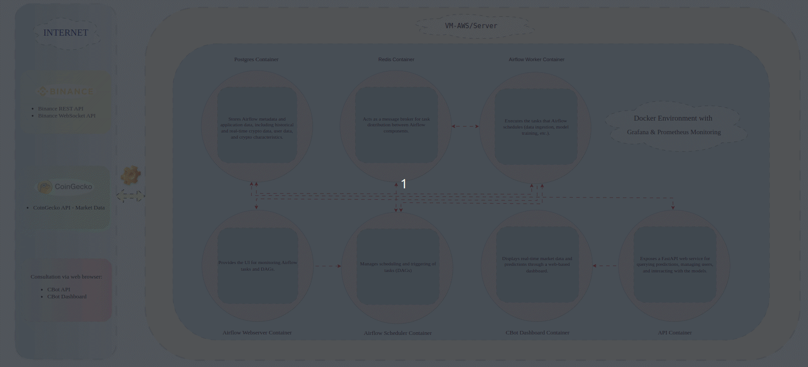

# CBot



## Description
CBot est un projet de prédiction et de surveillance en temps réel des cryptomonnaies, principalement pour les paires BTC/USDT et ETH/USDT. Le projet télécharge et analyse les données historiques et en temps réel depuis Binance et CoinGecko, entraîne des modèles de prédiction, et prend des décisions en fonction de l'évolution des prix. CBot utilise Airflow pour orchestrer les tâches, FastAPI pour l'API REST, et Dash pour afficher les données sur un tableau de bord interactif.

## Fonctionnalités
1. **Téléchargement des données historiques** : Les données des paires BTC/USDT et ETH/USDT sont téléchargées depuis Binance pour la période du 01-04-2020 au 30-10-2024, avec un intervalle par défaut de 15 minutes.
2. **Stream de données en temps réel** : Les données des paires BTC/USDT et ETH/USDT sont récupérées toutes les 5 secondes via WebSocket et stockées dans la table `stream_crypto_data`.
3. **Prédiction de la fermeture de la bougie actuelle** : Un modèle est entraîné chaque mois avec les données historiques et utilisé pour effectuer des prédictions.
4. **Tableau de bord interactif** : Le tableau de bord Dash affiche les données des 30 derniers jours, les volumes échangés, les prédictions et les caractéristiques des cryptomonnaies.
5. **Authentification utilisateur** : Les utilisateurs peuvent être ajoutés, supprimés et authentifiés via l'API FastAPI.
6. **Orchestration avec Airflow** : Toutes les tâches sont orchestrées par Airflow : ingestion des données, mise à jour, entraînement de modèles et prédictions.
7. **Monitoring avec Grafana et Prometheus** : La supervision est réalisée avec Grafana et Prometheus.

## Structure du Projet

```bash
CBot/
├── app/                                 # API et tableau de bord
│   ├── app.py                           # API FastAPI
│   ├── dashboard.py                     # Tableau de bord Dash
│   └── tools_app.py                     # Outils pour les prédictions et décisions
├── dags/                                # DAGs d'Airflow
│   ├── crypto_data_ingestion_dag.py     # Ingestion des données toutes les 15 minutes
│   ├── dashboard_dag.py                 # Lancement du dashboard via Airflow
│   ├── train_model_dag.py               # Entraînement des modèles chaque mois
│   └── websocket_stream_dag.py          # Ingestion des données en temps réel
├── docker/                              # Fichiers Docker
│   ├── Dockerfile_airflow               # Dockerfile pour Airflow
│   └── Dockerfile_api                   # Dockerfile pour l'API FastAPI
├── logs/                                # Répertoire pour stocker les logs d'Airflow
├── model/                               # Répertoire pour stocker les modèles entraînés (.pkl)
├── plugins/                             # Plugins Airflow (si nécessaires)
├── scripts/                             # Scripts pour la récupération et le stockage des données
│   ├── fetch_data.py                    # Téléchargement des données de CoinGecko et Binance
│   ├── lib_sql.py                       # Librairie SQL pour les opérations sur la base de données
│   ├── store_data.py                    # Stockage des données dans PostgreSQL
│   ├── train_model.py                   # Script d'entraînement des modèles
│   └── websocket_stream.py              # Gestion des WebSockets pour les données en temps réel
├── sql/                                 # Scripts SQL
│   └── init_db.sql                      # Initialisation de la base de données
├── Cbot.gif                             # Schéma général du projet
├── docker-compose.yml                   # Fichier de configuration Docker Compose
├── README.md                            # Documentation du projet
├── requirements_airflow.txt             # Dépendances pour Airflow
├── requirements_api.txt                 # Dépendances pour l'API
└── monitoring/                          # Supervision
    ├── alertmanager/                    # Configuration d'AlertManager
    │   ├── alert.rules/alerts.rules.yml
    │   ├── alertmanager.yml
    │   └── templates/default.tmpl
    ├── bin/                             # Binaire de supervision
    │   ├── my_entrypoint.sh
    │   ├── node_exporter
    │   └── statsd_exporter
    ├── blackbox/blackbox.yml            # Supervision des URL
    ├── grafana/                         # Configuration de Grafana
    │   ├── dashboards/                  # Dashboards pour Grafana
    │   │   ├── airflow_grafana_dashboard.json
    │   │   ├── alertmanager.json
    │   │   ├── blackbox-exporter.json
    │   │   └── monitoring-machine.json
    │   ├── dashboards.yml
    │   ├── datasource.yml
    │   └── grafana.ini
    └── prometheus/prometheus.yml        # Configuration de Prometheus

```

## Prérequis

- **Docker** : Version 20.x ou supérieure
- **Docker Compose** : Version 1.29.2 ou supérieure
- **Airflow** : Version 2.8.1
- **Python** : Version 3.8
- **Grafana** : Version 8.5.20
- **Prometheus** : Version 2.11.1

## Installation

1. Clonez le dépôt du projet :
```bash
git clone https://github.com/your-repo/CBoat.git
cd CBot
```

2. Créez et configurez un fichier `.env` pour les clés d'API Binance et CoinGecko :
```bash
echo "BINANCE_API_KEY=your_binance_api_key" > .env
echo "BINANCE_API_SECRET=your_binance_api_secret" >> .env
```

3. Construisez et lancez les conteneurs Docker avec Docker Compose :
```bash
docker-compose up --build
```

4. Initialisez la database
```bash
psql --host 0.0.0.0 --port 5432 --user airflow -f sql/init_db.sql
```

5. Accédez à l'interface Airflow pour vérifier les DAGs : 
    http://localhost:8080

6. Le tableau de bord Dash est accessible à l'adresse :
    http://localhost:8050

7. L'API FastAPI est accessible à l'adresse :
    http://localhost:8000

8. Le monitoring est accessible aux adresses :

| Monitoring    | Adresses              |
|---------------|-----------------------|
| Prometheus    | http://localhost:9090 |
| Alertmanager  | http://localhost:9093 |
| Grafana       | http://localhost:3000 |
| Node exporter | http://localhost:9100 |

## Fonctionnement

1. **Ingestion des données** : Les données des paires BTC/USDT et ETH/USDT sont téléchargées via Binance et CoinGecko et stockées dans la base de données PostgreSQL.
2. **Prédiction des prix** : Un modèle de forêt aléatoire est entraîné chaque mois avec les données historiques, et utilisé pour prédire la fermeture de la bougie en cours.
3. **Affichage en temps réel** : Le tableau de bord Dash affiche les données historiques, les prédictions et les informations en temps réel via l'API et les données de la table `stream_crypto_data`.

## Endpoints API

- **/healthcheck** : Vérifie l'état de la base de données.
- **/add_user** : Ajoute un utilisateur dans la base de données PostgreSQL.
- **/delete_user** : Supprime un utilisateur de la base de données.
- **/predict_and_decide** : Prédit le prix de clôture et fournit une décision (Buy, Sell ou Hold).
- **/get_current_price** : Récupère le dernier prix de clôture de la cryptomonnaie en temps réel.
- **/get_crypto_characteristics** : Récupère les caractéristiques d'une cryptomonnaie (nom, symbole, market_cap, circulating_supply, max_supply).
- **/get_historical_data** : Récupère les données historiques (open, high, low, close, volume) pour une cryptomonnaie donnée.

## Configuration

Les paramètres de configuration, comme les intervalles de téléchargement des données et les modèles à entraîner, sont ajustables dans les variables Airflow.

| Nom de la variable                  | Description                                | Valeur         |
|-------------------------------------|--------------------------------------------|----------------|
| `crypto_data_ingestion_date_end`    | End date for crypto_data_ingestion DAG     | 2024-10-30     |
| `crypto_data_ingestion_date_start`  | Start date for crypto_data_ingestion DAG   | 2020-04-01     |
| `crypto_data_ingestion_interval`    | Interval for crypto_data_ingestion DAG     | 15m            |
| `train_model_date_end`              | End date for train_model DAG               | 2024-10-30     |
| `train_model_date_start`            | Start date for train_model DAG             | 2020-04-01     |
| `train_model_interval`              | Interval for train_model DAG               | 15m            |
| `websocket_stream_interval`         | Interval for websocket_stream DAG          | 5s             |

## Grafana

- **login** : `admin`

- **password** : `adminopa2024`

## Auteur

- [LAKACHE Khaled](https://github.com/Klakache)
- [PUJOS Sylvain](https://github.com/Sylvain35410)

## Licence

Ce projet est sous licence [MIT](LICENSE).
